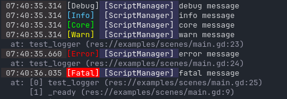

# hanpeki-godot-logger

[](https://github.com/hanpeki/hanpeki-godot-logger/actions/workflows/tests.yml) [](https://github.com/hanpeki/hanpeki-godot-logger/actions/workflows/linting.yml) [](https://opensource.org/licenses/MIT)

> A customizable logging system for Godot with transports and namespaces.



## Features

- ☑ Configurable logging system
- ☑ Console and file transports provided by default
- ☑ Customizable and extensible transports
- ☑ Support for custom log levels
- ☑ Flexible, non-linear log levels
- ☑ Dedicated namespaces
- ☑ Per-level and per-namespace configuration

Check the [API documentation here](./docs/README.md), set [example code here](./examples/README.md), or keep reading for an introduction.

### What is a transport?

A transport is a way to handle a log event — it "transports" the event from its origin to an output.

For example:

- When a log event is triggered, `HanpekiLoggerConsoleTransport` decides how to display it in the console.
- `HanpekiLoggerFileTransport` writes the log event to a file.

`HanpekiLogger` lets you customize these transports or define new ones with custom formats and outputs (e.g. sending logs to a remote service like Sentry).

### What is a namespace?

A namespace is a way to group and categorize logs. How you use them is up to you.

For example:

- UI nodes could log using the `"UI"` namespace.
- A `ScriptManager` could log with its own namespace.

This makes it easy to enable or disable logs, format them differently, and manage them efficiently. The system has no built-in limit on how you define namespaces.

## Usage

This plugin provides a class called `HanpekiLogger` without creating any singleton, giving you freedom in how you organize your code.

Since this is a utility, there’s no need to attach a `Node` as in some other libraries. You can simply use a static class, or create a singleton instance if that fits your project.

### Quick Example

Because this addon puts first flexibility and freedom over opinionated code, a small configuration step is required. In return, it provides greater customization and flexibility, making it a solid option for projects of any size.

In the following example, `Log` is used for simplicity and readability.

```gdscript
#
# log.gd
#

class_name Log

# Raw logger instance
# Usually wouldn't be used if all the code is properly organized in categories
# but it depends on the project, and it's done here to show usage examples
static var instance: HanpekiLogger

# Logger bound to the "UI" namespace
static var ui: HanpekiLogger.WithBindedNs
# Logger bound to the "ScriptManager" namespace
static var scriptManager: HanpekiLogger.WithBindedNs


static func init() -> void:
  var options = HanpekiLogger.Options.new()
  # Don't log debug and info messages by default
  options.levels = ["fatal", "error", "warn"]
  instance = HanpekiLogger.create(options)

  # Enable logging to the console
  instance.add_transport(HanpekiLoggerConsoleTransport.create())

  # Enable logging to a file
  instance.add_transport(HanpekiLoggerFileTransport.create())

  # Initialize the logger with namespaces
  ui = instance.bind_ns(&"UI")
  scriptManager = instance.bind_ns(&"ScriptManager")

  # Enable the "info" level only for the ScriptManager namespace
  scriptManager.enable_level(HanpekiLogger.INFO, true)

```

```gdscript
#
# From the main scene
#

# Simple messages without namespace can be logged like this
Log.instance.debug("Message without namespace")
# Or provideing namespaces manually
Log.instance.debug("Message with namespace", "Namespace")


#
# From some UI menu
#

# The "info" message won't appear with the given options
Log.ui.info("Options menu opened")

if (something_bad_happened):
  Log.ui.error("Oh no! Something bad happened")
```

```gdscript
#
# From the Script Manager
#
Log.scriptManager.warn("There's no previous state!")

# The "debug" message won't appear either
Log.scriptManager.debug("Initializing default states")

# But "info" messages will do just for this namespace!
Log.scriptManager.info("States initialized")
```
