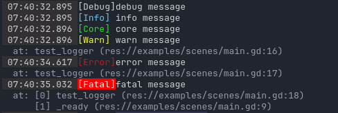

# Examples

This folder has godot code showing how to setup some `HanpekiLogger` [configuration](./singletons/log.gd) and [usage](./scenes/main.gd) for your project.

Example of the logger with namespaces:

Example of the logger without namespaces:

